# DOOM Engine — Technical Architecture

> All diagrams use [Mermaid](https://mermaid.js.org/) syntax.  
> View in GitHub, VS Code with the Mermaid extension, or at [mermaid.live](https://mermaid.live).

---

## 1. Repository Structure

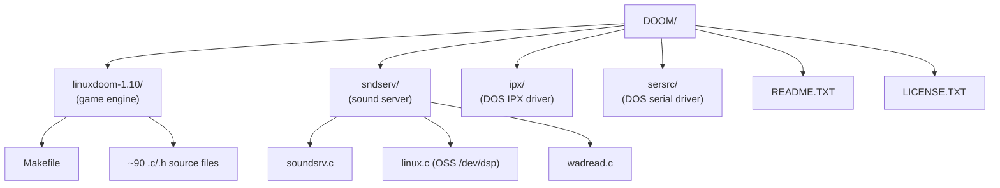

---

## 2. High-Level Subsystem Map

```mermaid
graph LR
    subgraph HAL ["Platform Layer (i_*)"]
        IV[i_video.c<br/>X11 display]
        IS[i_sound.c<br/>sndserv IPC]
        ISY[i_system.c<br/>clock / exit]
        IN[i_net.c<br/>UDP sockets]
        IM[i_main.c<br/>main()]
    end

    subgraph CORE ["Core Engine"]
        DM[d_main.c<br/>D_DoomMain / D_DoomLoop]
        GG[g_game.c<br/>game state machine]
        DN[d_net.c<br/>network lockstep]
    end

    subgraph RENDER ["Renderer (r_*)"]
        RM[r_main.c<br/>view setup]
        RB[r_bsp.c<br/>BSP traversal]
        RS[r_segs.c<br/>wall columns]
        RP[r_plane.c<br/>visplanes]
        RT[r_things.c<br/>sprites]
        RD[r_draw.c<br/>pixel writers]
        RDA[r_data.c<br/>texture cache]
    end

    subgraph PLAY ["Play Subsystem (p_*)"]
        PT[p_tick.c<br/>thinker list]
        PM[p_map.c<br/>collision]
        PO[p_mobj.c<br/>actors]
        PE[p_enemy.c<br/>monster AI]
        PU2[p_user.c<br/>player movement]
        PI[p_inter.c<br/>damage / pickup]
        PS[p_spec.c<br/>sector specials]
        PP[p_setup.c<br/>level load]
    end

    subgraph MEM ["Memory & Data"]
        ZZ[z_zone.c<br/>zone allocator]
        WW[w_wad.c<br/>WAD filesystem]
        INFO[info.c<br/>actor state tables]
        TAB[tables.c<br/>trig LUTs]
    end

    subgraph HUD ["HUD & UI"]
        ST[st_stuff.c<br/>status bar]
        HU[hu_stuff.c<br/>messages / chat]
        AM[am_map.c<br/>automap]
        MM[m_menu.c<br/>menus]
        WI[wi_stuff.c<br/>intermission]
        FF[f_finale.c<br/>finale]
    end

    subgraph AUDIO ["Audio"]
        SS[s_sound.c<br/>channel mixer]
        SRV[sndserv/<br/>sound server]
    end

    IM --> DM
    DM --> GG
    DM --> DN
    DM --> RENDER
    DM --> PLAY
    DM --> HUD
    DM --> AUDIO
    GG --> PLAY
    GG --> HUD

    RENDER --> MEM
    PLAY --> MEM
    AUDIO --> SS
    SS --> SRV
    SRV -->|OSS| DEV["/dev/dsp"]
    IV -->|framebuffer| X11["X11 window"]
    IN -->|UDP| NET["Network"]
```

---

## 3. Main Game Loop

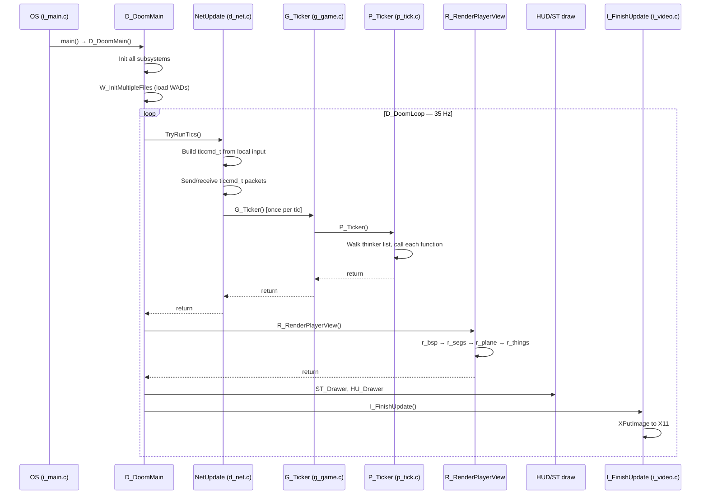

---

## 4. Game State Machine

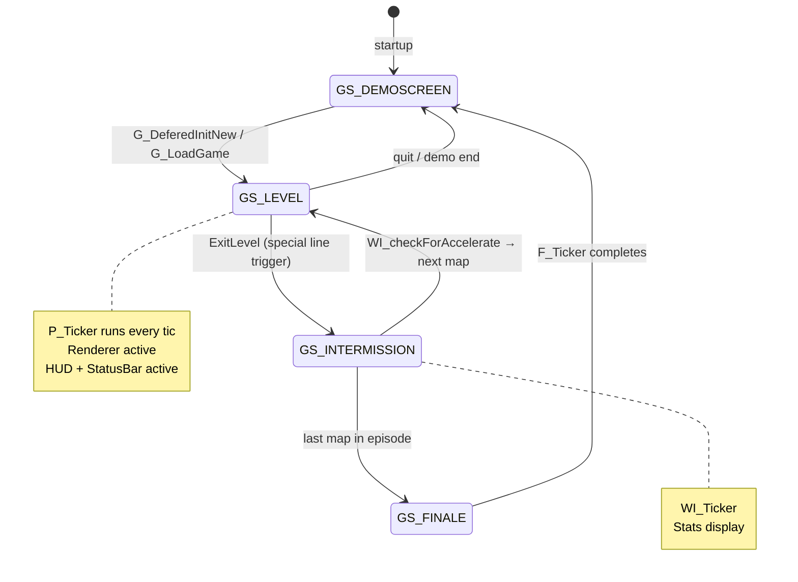

---

## 5. Renderer Pipeline (per frame)

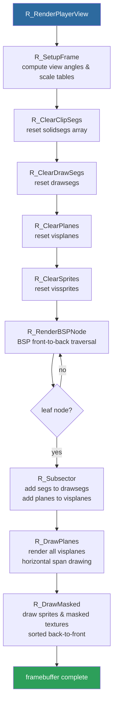

---

## 6. BSP Tree Structure

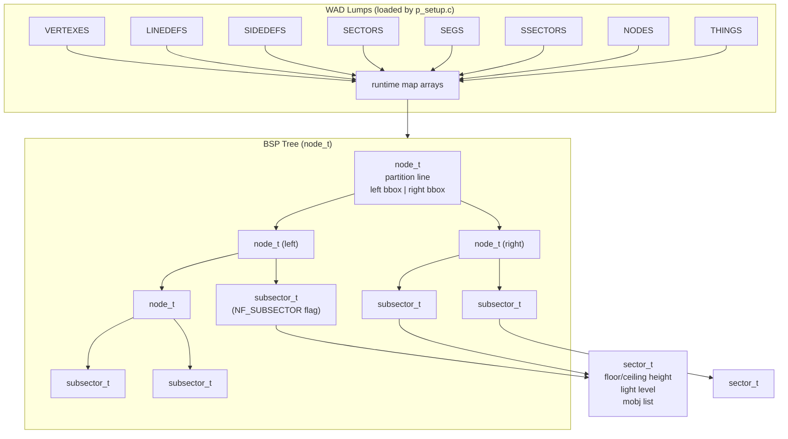

---

## 7. Actor (mobj_t) Lifecycle

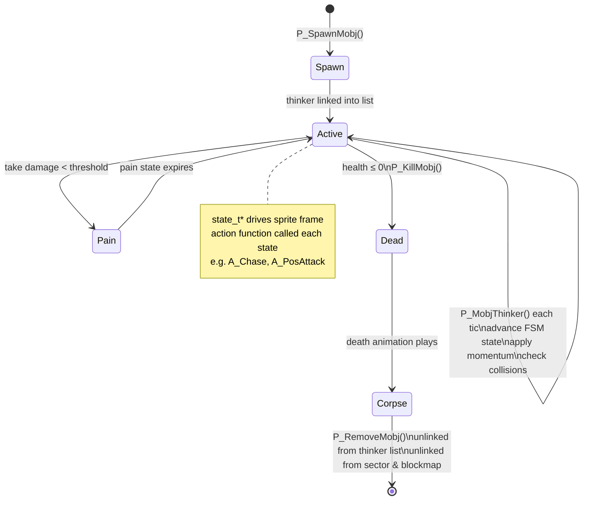

---

## 8. Thinker System

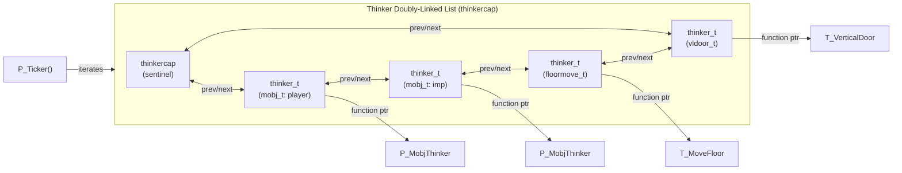

---

## 9. WAD Filesystem

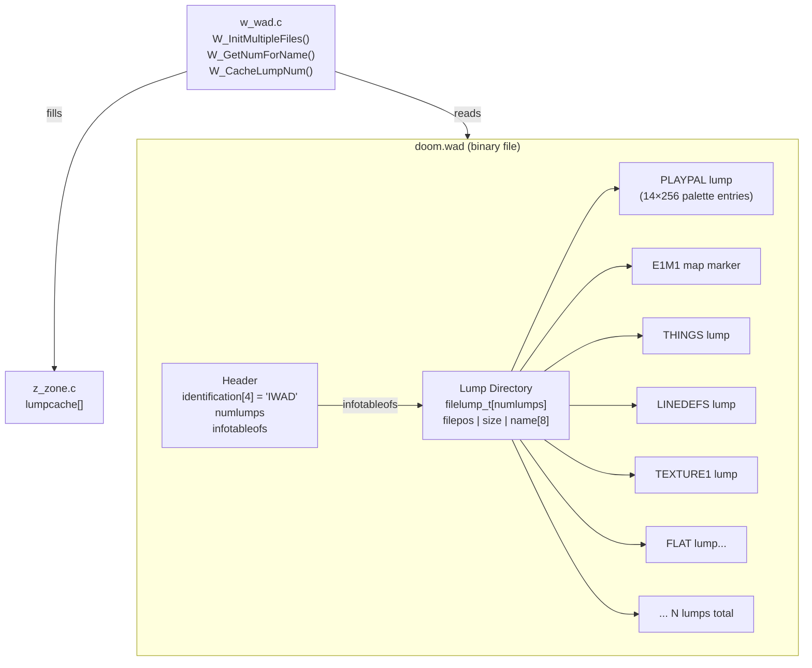

---

## 10. Zone Memory Allocator

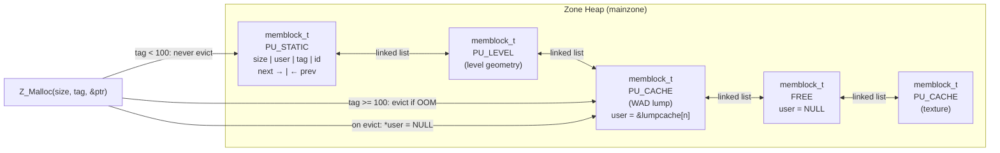

---

## 11. Network Lockstep Protocol

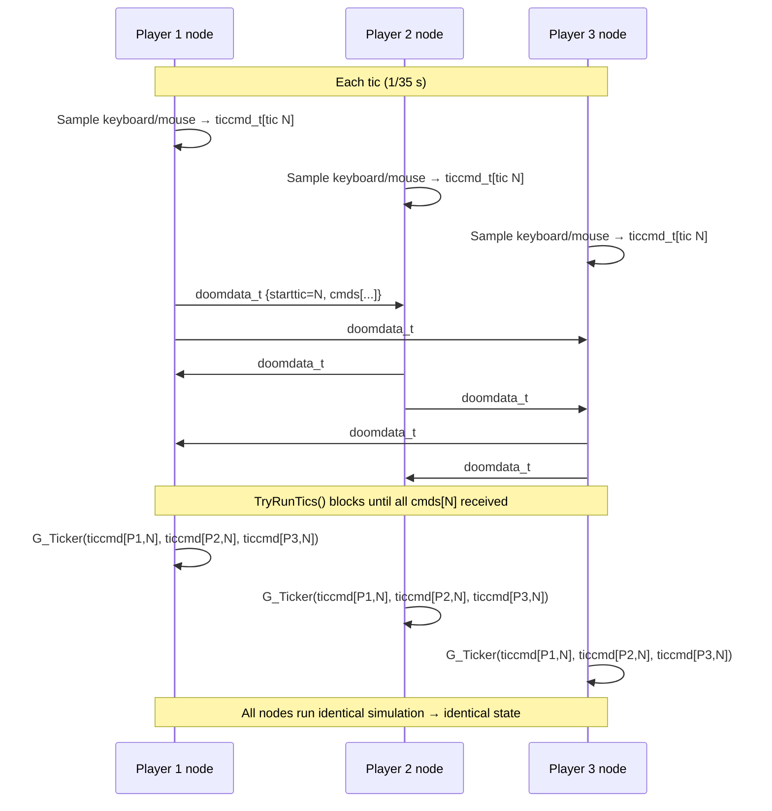

---

## 12. Sound Architecture

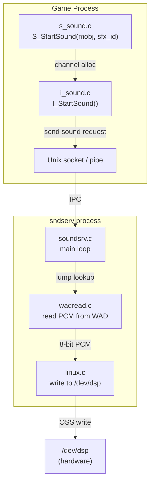

---

## 13. Key Data Structure Relationships

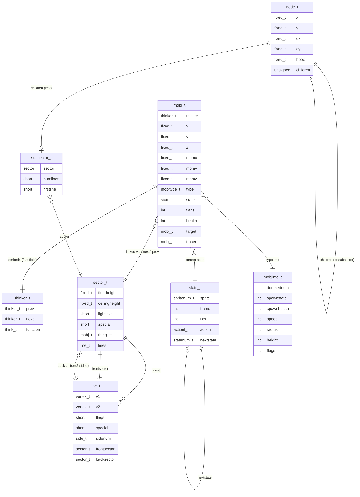

---

## 14. Fixed-Point Arithmetic

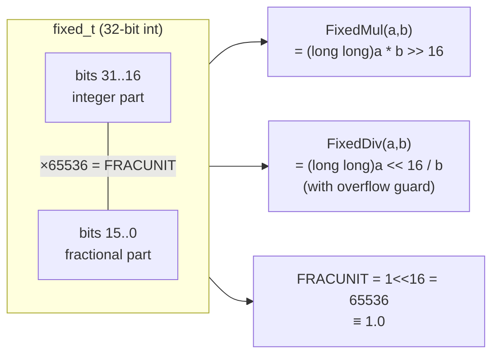

All world coordinates, scales, and trigonometric values use `fixed_t`.  The angle type `angle_t` is a 32-bit **Binary Angle Measurement** (BAM): `0x40000000` = 90°.  Sine/cosine are pre-computed into `finesine[]` / `finecosine[]` tables (8192 entries) in `tables.c`.

---

## 15. Sprite & Texture Pipeline

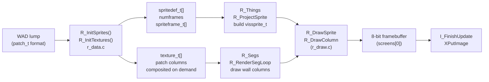

---

## 16. Component Dependency Graph

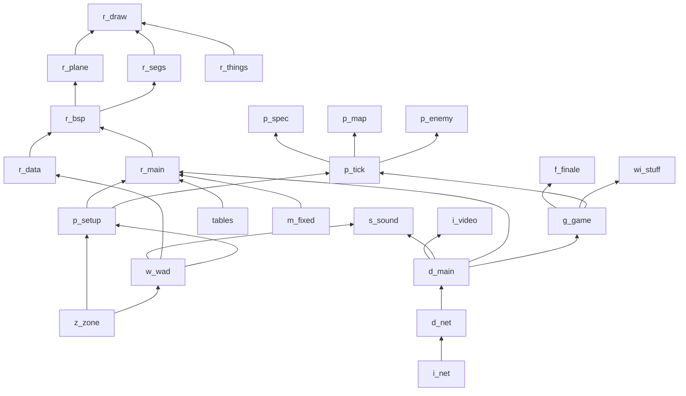
